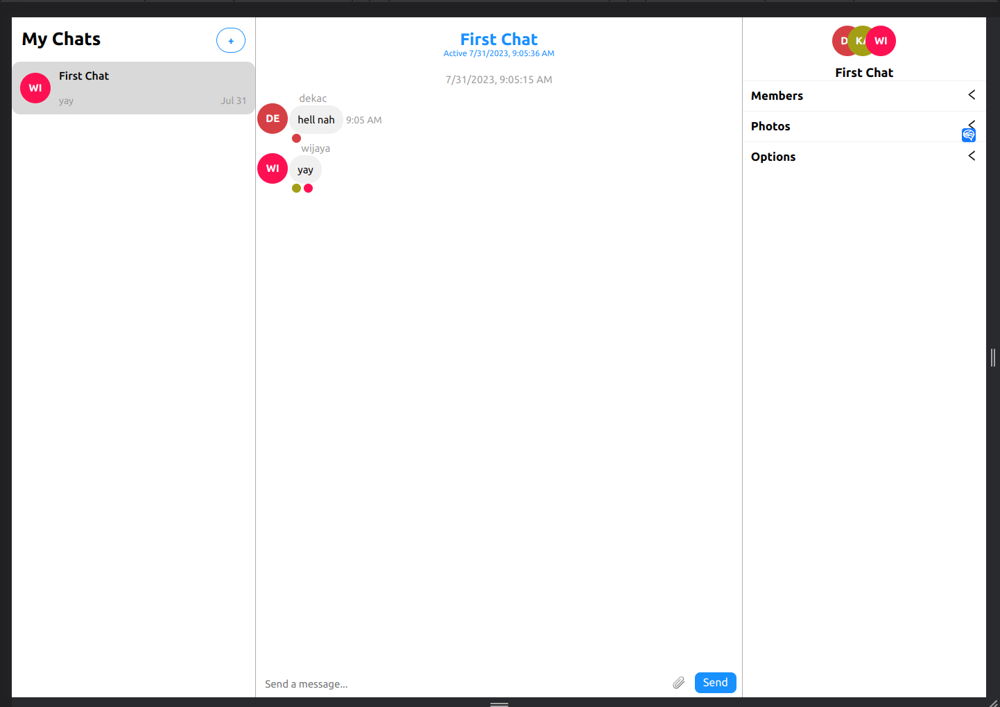

# Chat Application using ChatEngine

## Overview

This is a chat application built using ChatEngine, a third-party chat plugin that allows developers to easily integrate chat functionality into their applications. The application provides real-time chat features, allowing users to send and receive messages in real time.

## Features

- Real-time messaging: Users can send and receive messages instantly, enabling seamless communication.
- Multiple chat rooms: The application supports multiple chat rooms, allowing users to join and participate in different conversations.
- User authentication: Users can create accounts and log in to access the chat features securely.

## Getting Started

Follow these steps to get the chat application up and running:

1. Clone the repository to your local machine.
2. Install the necessary dependencies by running `npm install` both on frontend & backend folder.
3. Set up the ChatEngine account and obtain the required API keys.
4. Configure the application with the ChatEngine API keys.
5. Start the application using `npm run dev` on frontend project & `npm run start` on backend project.
6. Access the chat application in your web browser.

## Dependencies

The chat application relies on the following dependencies:

- [ChatEngine](https://chatengine.io/): The core chat engine that powers real-time messaging and chat functionality.
- [React](https://reactjs.org/): The JavaScript library used for building the user interface components.
- [Node](https://nodejs.org/): JavaScript Runtime

## License

The chat application is open-source and distributed under the [MIT License](LICENSE).

Happy chatting! 🚀
